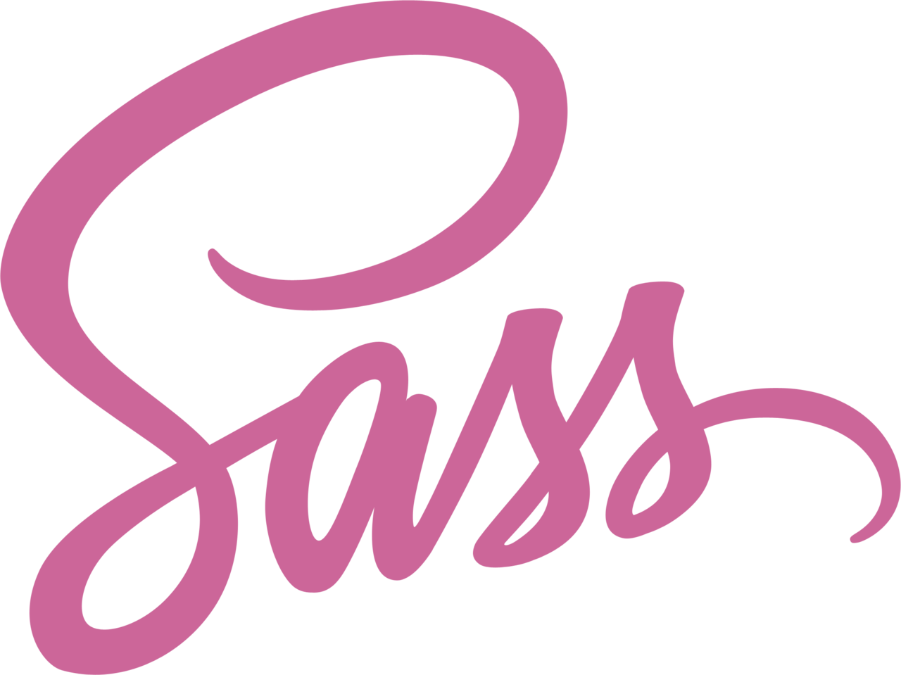
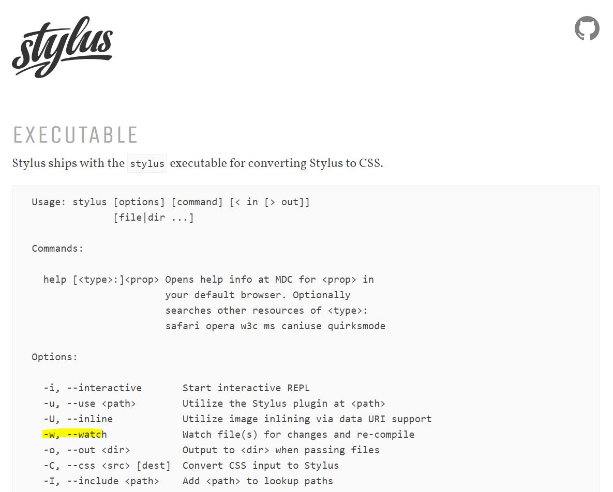
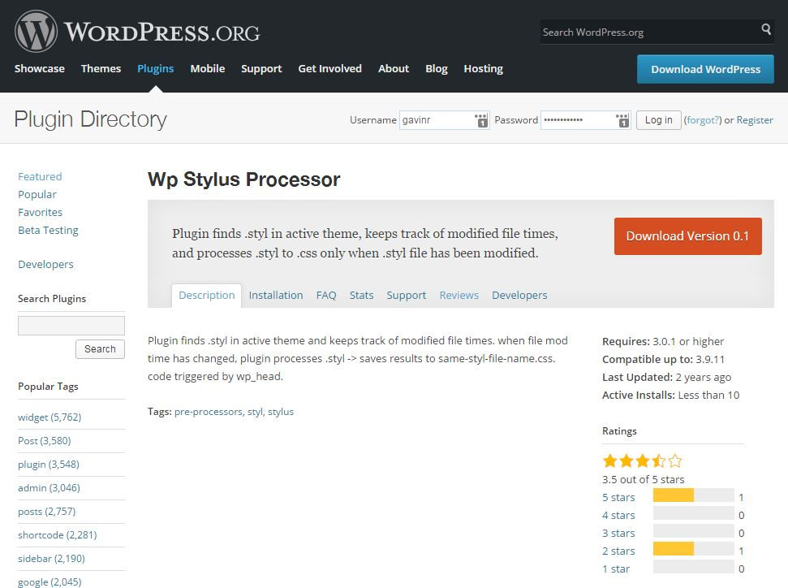

# Stylus and WordPress

Gavin Rehkemper

<a href="https://twitter.com/gavinrehkemper"><i class="fa fa-twitter" title="Twitter"></i>/gavinrehkemper</a><br />
<a href="https://twitter.com/gavinrehkemper"><i class="fa fa-github" title="GitHub"></i>/gavinr</a>

Note:
- Intro
- Topic: ....  CSS Preprocessor - makes writing page styles easier

---


Note:
- We're all developers here. Which means we're all lazy. Summer is coming up - I want to hit the pool! And being lazy is a great thing! Because it makes us more ...

---


Note:
- Efficient.

---


Note: None of us like writing more code than necessary. Which is important when on tough or time sensitive projects, which often feel like this.

---


Note: So the goal for today is to take write CSS, which if you're writing modular code, the syntax can often get quite verbose, repetitive, and unweily, in a much more efficient manner.

---

# Solution

Note:  CSS Preprocessors are our solution. These make CSS better by introducing an alternative simpler, more readable syntax, as well as additional features like variables, functions, mixins, conditionals, and more.

---


---



---


---

<blockquote>Stylus has the power of Sass, with the accessibility of LESS.<br /><a href="http://webdesign.tutsplus.com/articles/why-i-choose-stylus-and-you-should-too--webdesign-18412">-Kezz Bracey</a></blockquote>

Note: you can use any

---

```
.page .wrapper h1.title {
  color: red;
}
```

---

```
.page .wrapper h1.title {
  color: red
}
```

---

```
.page .wrapper h1.title {
  color red
}
```

---

```
.page .wrapper h1.title
  color red

```
---

```
.page
	.wrapper
		h1.title
  			color red

```

---

<table width="100%">
<tr>
<td>
<section>
    <pre><code data-trim data-noescape>
.page {
	background-color: #800000;
}
.page .section {
	width: 20px;
	height: 30px;
	background-color: #800000;
}
.page .section h1 {
	font-size: 4rem;
}
.page .section p {
	text-transform: uppercase;
}
    </code></pre>
</section>
</td><td>
    <pre><code data-trim data-noescape>
myRed = #800000
.page
	background-color myRed
	.section
		width 20px
		height 30px
		background-color myRed
		h1
			font-size 4rem
		p
			text-transform uppercase
    </code></pre>
</td>
</tr>
</table>
---

`npm install stylus -g`

[stylus-lang.com](http://stylus-lang.com/)

---



---


`npm install grunt-contrib-stylus`

---



---

`css/main.styl`

```
wp_enqueue_style( 'style-main', get_template_directory_uri() . '/css/main.css' );
```

---


Note: So using Stylus, or even LESS or SASS in YOUR project will make the styling of your WordPress sites much more easy, so that gives you a lot more time to hit the pool this summer. Thank You!

---

# Thank You!

[gavinr.github.io/presentations](http://gavinr.github.io/presentations)